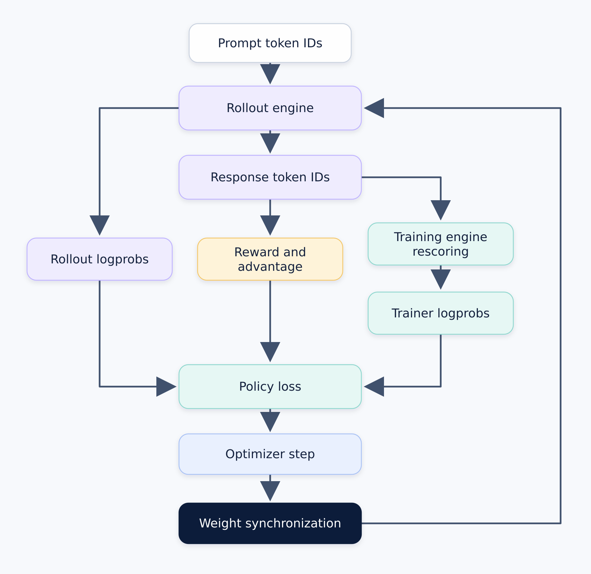

# One Token, Two Probabilities: A Practical Guide to Debugging Logprob Mismatch in LLM RL

Modern LLM reinforcement learning (RL) often runs one policy through two systems. A rollout engine generates responses. A training engine scores those responses, computes the loss, and updates the model.

Given the same weights, token prefix, and next token, both engines should assign that token the same probability. In practice, they may not. Rollout may use a key-value (KV) cache, continuous batching, quantized weights, fused kernels, and inference-specific parallelism. Training may use different precision, model code, and kernels that support backward propagation.

Some differences come from floating-point execution. Others come from correctness bugs, such as different token IDs, stale weight shards, an incorrect mask, or inconsistent Mixture-of-Experts (MoE) routing.

This train-rollout logprob mismatch directly affects PPO, GRPO, and related methods because their learning rules use probability ratios. An incorrect ratio changes the gradient and can destabilize training.

This guide presents a framework-independent debugging method. The core rule is:

> **Generate once. Save the exact token IDs. Score those same tokens everywhere.**

The goal is to identify the first system boundary where the result changes.

## Where the mismatch enters the RL loop

An online LLM RL system has two main execution paths:

<p align="center">
  
</p>

The **rollout engine** generates response tokens and records their logprobs. The **training engine** reads those tokens, computes their logprobs again, and uses them in the policy loss. After the optimizer step, new weights are synchronized back to rollout.

The reward measures response quality. The **advantage** compares that reward with a baseline and determines whether training should make the sampled tokens more or less likely.

A logprob difference can enter at several boundaries:

- the two engines may receive different tokens, positions, or masks;
- rollout may contain stale or incorrectly converted weights;
- decode, prefill, and training may use different numerical paths;
- weight synchronization may update only part of the rollout model;
- sampling, quantization, asynchronous execution, or sparse routing may intentionally change the behavior policy.

The logprob difference is therefore a symptom. Debugging must determine which boundary produced it.

## Define the comparison precisely

A language model assigns a probability to every possible next token. A **log-probability**, or **logprob**, is the natural logarithm of one of those probabilities.

For token position $t$, define:

```math
\Delta_t
=
\ell_t^{\mathrm{train}}
-
\ell_t^{\mathrm{rollout}},
```

where:

- $t$ is the token position;
- $\ell_t^{\mathrm{rollout}}$ is the logprob recorded during rollout;
- $\ell_t^{\mathrm{train}}$ is the trainer's logprob for the same token;
- $\Delta_t$ is the signed difference.

The corresponding probability ratio is $\exp(\Delta_t)$. If rollout assigns probability 0.10 and training assigns 0.12, then $\Delta_t$ is about 0.183 and the ratio is 1.20. The trainer considers that token 20 percent more likely.

The formula defines the mismatch. To debug it, first create one fixed example that both engines can score repeatedly.

## Build one fixed replay case

Before changing any configuration, save one sample that reproduces the problem. This is sometimes called a **golden trajectory**. Golden describes its role as a fixed test fixture. It does not mean the output is correct or the logprob difference is small.

Capture the sample where rollout data enters the training pipeline, before the optimizer updates the model. This timing matters because an optimizer step is supposed to change token probabilities. The first test should compare the two engines before learning changes the weights.

Save these tensors on CPU:

~~~python
import torch

replay = {
    "model_version": model_version,
    "tokenizer_version": tokenizer_version,
    "input_ids": input_ids.cpu(),
    "position_ids": position_ids.cpu(),
    "attention_mask": attention_mask.cpu(),
    "response_mask": response_mask.cpu(),
    "rollout_logprobs": rollout_logprobs.cpu(),
    "sampling_config": sampling_config,
}
torch.save(replay, "logprob_replay.pt")
~~~

The saved input IDs must contain the exact prompt and response token IDs used by the run. The response mask identifies the generated tokens included in the loss.

Add model-specific metadata when needed:

- MoE expert IDs for each scored token and layer;
- quantization format, scales, and checkpoint version;
- policy version for asynchronous rollout;
- sequence boundaries for packed or multi-turn inputs.

Do not save only decoded text. Retokenization can change whitespace, special tokens, chat-template boundaries, and tool-call serialization.

During replay, both engines receive the saved sequence and score the saved next tokens through teacher forcing. Neither engine generates a new response. Both use the saved model version, so the test measures execution differences rather than a real policy update.

## Separate the problem into three scores

Use three labels throughout the investigation:

| Label | Execution path | Value |
|---|---|---|
| **A: rollout decode** | Rollout generates one token at a time | Logprob saved when the token was sampled |
| **B: rollout prefill** | Rollout replays the complete saved sequence | Logprob for the saved token under teacher forcing |
| **C: trainer forward** | Training replays the same sequence without backward or an optimizer step | Trainer logprob for the saved token |

These are three executions of one saved sample, not three different responses. A was recorded during the original generation. B and C score that same response without generating new tokens.

Rollout frameworks may record logprobs at two different stages. A **raw model logprob** is calculated before sampling settings are applied. A **behavior logprob** is calculated after settings such as temperature, top-k, or top-p modify the distribution. Both are valid, but they are different numbers. A, B, and C must use the same stage.

These scores isolate two important boundaries:

- **A versus B** tests decode against prefill inside the rollout engine.
- **B versus C** tests rollout against training without decode or sampling.

## Measure the complete error distribution

Choose the pair being tested. For example, use B as the baseline and C as the candidate when comparing rollout prefill with trainer forward.

Apply the response mask, calculate in float64, and report more than one average:

~~~python
import torch

delta = (
    candidate_logprobs.double() - baseline_logprobs.double()
)[response_mask.bool()]

finite = torch.isfinite(delta)
assert finite.any(), "no finite logprob differences"
d = delta[finite]
a = d.abs()

stats = {
    "signed_mean": d.mean(),
    "mean_abs": a.mean(),
    "p95_abs": a.quantile(0.95),
    "p99_abs": a.quantile(0.99),
    "max_abs": a.max(),
    "nonfinite_rate": (~finite).double().mean(),
}
~~~

The signed mean shows whether one path is systematically higher. Mean absolute error shows the typical magnitude. p95, p99, and maximum expose the tail. The non-finite rate catches NaNs and infinities.

Avoid using only the mean of $\exp(\Delta_t)$. Exponentiation amplifies large positive outliers and can overflow.

There is no universal acceptable threshold. Establish a same-version, forward-only baseline for the target model and hardware. Then track the distribution by token position, response length, batch shape, model version, and training step. For MoE models, also group results by whether expert routes match.

## Debug one boundary at a time

The following steps progress from exact data checks to full RL execution. Do not continue past a failed contract check.

### 1. Verify the token-scoring contract

Construct the teacher-forced batches for B and C from the replay artifact. Compare all discrete inputs exactly:

~~~python
for name in ("input_ids", "position_ids", "attention_mask", "response_mask"):
    assert torch.equal(rollout_batch[name], trainer_batch[name]), name
~~~

Also check sequence lengths, padding, packed-sequence boundaries, special tokens, tokenizer version, and chat-template version.

Next, verify the one-token shift used in teacher forcing:

~~~text
input:   [BOS, P1, P2, R1, R2]
targets: [     P1, P2, R1, R2]
~~~

Here P1 and P2 are prompt tokens, while R1 and R2 are generated response tokens.

The prediction after P2 scores R1. The prediction after R1 scores R2. The response mask must select those positions.

If this step fails, fix the input pipeline first. Different token events cannot produce a meaningful numerical comparison.

### 2. Verify the installed model state

A checkpoint name does not prove that every live rank contains the same model.

Pause training and generation. Record the expected model version, then verify that every rollout and trainer rank reports that version. Compare canonical parameter names, shapes, dtypes, and shard ownership.

For tensors stored in the same dtype and layout, a byte digest provides an exact check:

~~~python
import hashlib

def digest(t):
    raw = t.detach().contiguous().view(torch.uint8).cpu().numpy()
    return hashlib.sha256(raw.tobytes()).hexdigest()
~~~

Runtime layouts require a logical comparison. Tensor-parallel shards may be transposed or padded. Quantized weights may be packed with separate scales. Reconstruct a small canonical slice, dequantize it if necessary, and compare it with a documented tolerance. Check scales, zero points, expert order, and shard offsets separately.

Inspect weights after the inference engine finishes its load-time transformations. Comparing only the checkpoint on disk can miss an incorrect shuffle, pack, or post-load conversion. The [VIME debugging guide](https://docs.vllm.ai/projects/vime/en/latest/developer_guide/debug.html) describes this type of load and update inspection.

If the resident model state differs, fix weight mapping, sharding, conversion, or synchronization before investigating kernels.

### 3. Establish a repeatable reference

Compute B and C several times with the same artifact and frozen weights. Each path should be exact or remain inside a measured, stable tolerance.

Then vary one scheduling condition at a time:

- batch size 1 versus a production batch;
- the sample alone versus in a mixed batch;
- eager execution versus graph capture;
- cold versus warm cache;
- unchunked versus chunked prefill;
- one parallel layout versus another, when practical.

If repeated runs change, isolate mutable cache state, nondeterministic reductions, graph buffers, batch-dependent dispatch, or uninitialized memory before comparing engines.

### 4. Compare A with B

This test keeps the rollout model fixed while changing its execution schedule from decode to prefill.

A significant A-to-B difference points to the rollout path. Common areas include KV-cache dtype and indexing, decode-only attention or MoE kernels, chunk boundaries, graph-capture buffers, batch-dependent kernel selection, and sampling-logprob bookkeeping.

Keep A as recorded. Replacing it with the cleaner prefill result would discard evidence about the behavior policy that generated the data.

### 5. Compare B with C

This test removes decode and sampling. Any remaining difference lies between the rollout prefill path and the trainer forward path.

Start with comparable settings: the same stored weight precision, batch shape, and parallel degree. Restore production optimizations one at a time.

A failure can come from model equations, weight conversion, accumulation precision, fused kernels, reduction order, MoE routing, final log-softmax, or selected-token gathering. Changing several settings together may remove the symptom, but it will not identify the responsible boundary.

### 6. Locate the first divergence

When B and C differ, add matching observation points to both forward passes:

1. token embeddings;
2. residual stream entering selected transformer layers;
3. attention output;
4. dense MLP or MoE output;
5. residual stream leaving the layer;
6. final normalization;
7. vocabulary logits;
8. selected-token logprob.

At each point, record shape, dtype, finite status, norm, maximum absolute difference, and a deterministic tensor slice.

Compare every few layers first. Once the first bad interval is known, narrow it until one operation receives matching inputs but produces different outputs.

Use a tolerance appropriate for that operation and dtype. A tiny early difference is not automatically a bug. Focus on the first abrupt increase, non-finite value, discrete routing change, or violation of an operator's tested error bound.

### 7. Test one live weight update

After static parity is understood, cross the update boundary once:

1. Compute B0 and C0 with model version 0.
2. Apply one controlled trainer update.
3. Pause or drain generation.
4. Install model version 1 on every rollout rank.
5. Verify the new version and resident weights.
6. Compute B1 and C1 on the same replay.

Compare B0 with C0, then B1 with C1. Do not compare version-0 rollout logprobs with version-1 trainer logprobs and classify the result as implementation mismatch.

If parity breaks only after the update, inspect parameter mapping, shard assembly, expert placement, quantization-scale regeneration, tied weights, post-load processing, cache invalidation, and graph recapture.

Finally, run the smallest complete loop: one rollout batch, one trainer forward, one optimizer step, one weight synchronization, and a second rollout. If standalone parity passes but the loop fails, inspect orchestration, stale samples, mixed versions, partitioning, and update timing.

## Use the diff pattern to choose the next experiment

After the basic checks, plot the logprob difference by token position and training step. The pattern helps select the next experiment:

| What the diff looks like | What to test next |
|---|---|
| Large from the first scored token | Recheck the token shift, masks, positions, and installed weights |
| Grows with token position | Compare A with B at batch size 1, then inspect the KV cache and chunking |
| Changes across repeated runs or batch shapes | Repeat B and C independently, then vary one batch condition at a time |
| Only p99 or maximum spikes | Group the outliers by sequence, MoE route, layer, and kernel path |
| Jumps immediately after weight synchronization | Run the single-update test and verify resident weights on every rank |
| Rises after many training steps | Replay checkpoints immediately before and after the first surge |

### Investigating a late surge

If the diff is stable early in training and rises later, start with the first checkpoint where the change appears. Check weight synchronization first. A rollout rank may have missed an update, loaded the wrong shard, or failed to rebuild transformed or quantized weights.

Precision can also become more important as the model changes. Converting FP32 values to BF16 drops low-order bits, and the two engines may amplify that rounding differently if they cast, accumulate, or reduce in different ways. Experiments in [Defeating the Training-Inference Mismatch via FP16](https://arxiv.org/abs/2510.26788) found BF16 rounding to be a major source of mismatch and showed that FP16 reduced the gap.

Execution paths may change as well. A new batch shape or sequence length can select a different fused kernel, graph, or MoE route. Replay checkpoints from immediately before and after the surge with the same saved sample. Verify resident weights, then compare batch size 1 and eager execution with production settings. If needed, disable one precision or kernel optimization at a time and trace the first divergent operation.

If both checkpoints are stable offline but the live loop still fails, focus on synchronization, cache state, and asynchronous policy lag.

### Validating an optimized kernel path

Optimized kernels may change accumulation order, reduction order, fusion, or quantization. A numerical difference alone does not prove that the optimized result is incorrect.

Validate the first suspicious operation directly:

1. capture its exact input tensor;
2. run the optimized and reference implementations with the same device and dtype;
3. repeat both implementations to test determinism;
4. compare error with the operator's documented tolerance;
5. for MoE, also compare expert IDs and dispatch order;
6. disable only that operation and repeat the end-to-end replay.

Libraries such as [AITER](https://github.com/ROCm/aiter) provide operator-level tests that can serve as a starting point. Evidence is strong when the optimized operation is the first divergence, exceeds its intended tolerance, and disabling it restores end-to-end parity.

Exact execution can also be useful as a reference mode. vLLM's work on [bitwise-consistent training and inference](https://vllm.ai/blog/2025-11-10-bitwise-consistent-train-inference) demonstrates the value and performance tradeoff of aligning forward operators across engines.

## Add separate controls for intentional differences

Some configurations intentionally make rollout differ from training. They still require measurement.

| Case | Why the policies differ | Required control |
|---|---|---|
| Sampling transforms | Temperature, top-k, top-p, penalties, or processors change the behavior distribution | Compare the same probability stage and retain the behavior logprob |
| Quantized rollout | Rollout represents weights or activations at lower precision | Establish a non-quantized baseline, then measure the added gap |
| Asynchronous rollout | Workers may generate with an older model version | Attach a model version to every trajectory and separate parity from staleness |
| MoE routing | A small router difference can select another expert | Record expert IDs and compare matched-route and mismatched-route tokens |

For MoE models, routing replay can reuse rollout-time expert IDs during trainer scoring. If the heavy tail falls when routes match, routing is a major contributor. [Rollout Routing Replay](https://arxiv.org/abs/2510.11370) studies this approach in MoE RL systems.

These controls separate intentional policy differences from implementation errors. Fix different inputs, wrong weights, stale runtime state, and incorrect routes at their source. Importance sampling should not compensate for correctness bugs.

When a remaining gap is intentional, the behavior policy must be represented accurately in the training objective. Importance sampling can correct for that difference, often with truncation or rejection to control variance. The [verl rollout-correction guide](https://verl.readthedocs.io/en/latest/algo/rollout_corr.html) describes token-level and sequence-level options.

## Further reading

- [PyTorch numerical accuracy](https://docs.pytorch.org/docs/stable/notes/numerical_accuracy.html)
- [VIME debugging guide](https://docs.vllm.ai/projects/vime/en/latest/developer_guide/debug.html)
- [verl rollout correction](https://verl.readthedocs.io/en/latest/algo/rollout_corr.html)
- [Bitwise-consistent training and inference](https://vllm.ai/blog/2025-11-10-bitwise-consistent-train-inference)
- [FP16 and training-inference mismatch](https://arxiv.org/abs/2510.26788)
- [Diagnosing training-inference mismatch in LLM RL](https://arxiv.org/abs/2605.14220)
- [VeXact](https://github.com/verl-project/vexact)
- [Rollout Routing Replay](https://arxiv.org/abs/2510.11370)
- [AITER](https://github.com/ROCm/aiter)
