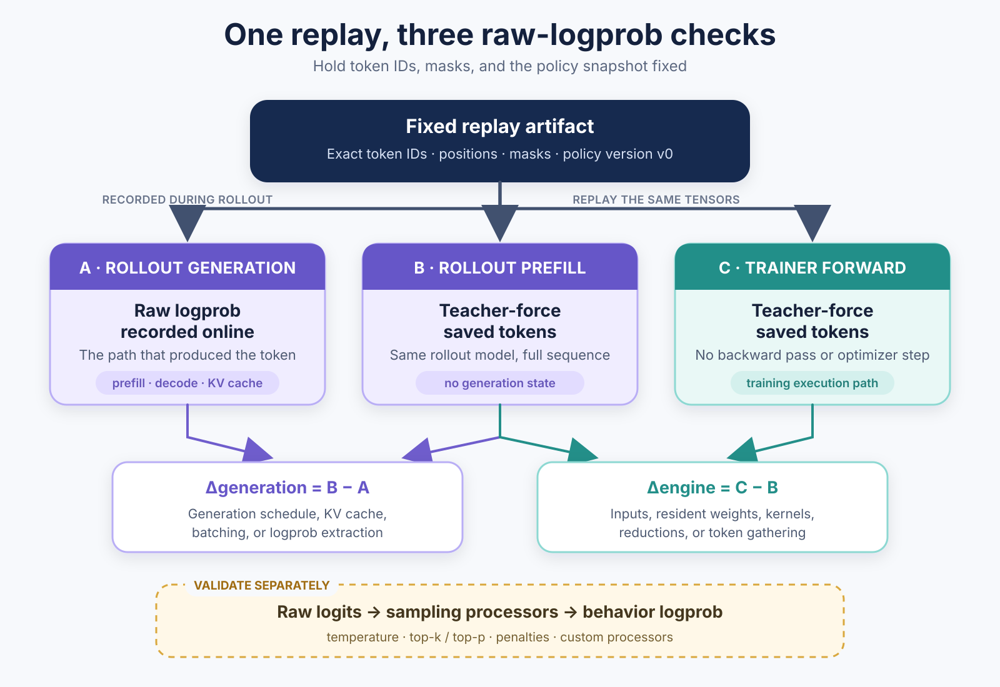

# One Token, Two Probabilities: Debugging Logprob Mismatch in LLM RL

Online LLM reinforcement learning usually runs one policy through two systems. A rollout engine generates responses and records token logprobs. A training engine scores those tokens again, computes the policy loss, updates the model, and sends the new weights back to rollout.

Given the same policy snapshot and token sequence, both engines should assign approximately the same raw logprob to each token. In practice, different inputs, weights, sampling stages, or execution paths can produce a mismatch. This matters because PPO, GRPO, and related objectives use probability ratios to determine the policy update.

The central debugging rule is:

> **Generate once. Save the exact token IDs. Score those same tokens everywhere.**

This post shows how to build one fixed replay and use three scores to locate the boundary where the mismatch begins.

## What is a logprob mismatch?

For a token $x_t$ with prefix $x_{<t}$, a language model assigns the log-probability

```math
\ell_t = \log p(x_t \mid x_{<t}).
```

If two execution paths produce logprobs $\ell_t^{(1)}$ and $\ell_t^{(2)}$, define

```math
\Delta_t = \ell_t^{(2)} - \ell_t^{(1)}.
```

Because a difference of logarithms is the logarithm of a ratio,

```math
\exp(\Delta_t)
=
\frac{p^{(2)}(x_t \mid x_{<t})}
     {p^{(1)}(x_t \mid x_{<t})}.
```

For example, probabilities 0.10 and 0.12 give $\Delta_t \approx 0.183$ and a ratio of 1.20.

This comparison is valid only when both paths use:

- the same token and token prefix;
- the same policy snapshot;
- the same probability definition, such as raw versus raw or behavior versus behavior.

If any of these conditions differs, this is not a valid parity comparison: the two logprobs do not describe the same token event under the same distribution.

## Why the mismatch matters

For a positive-advantage token in a PPO-style objective with $\epsilon=0.2$, a spurious ratio of 1.20 already reaches the upper clipping boundary. This does not mean every 0.183 logprob difference causes failure, but it shows why a modest difference in log space can affect optimization.

The policy objective needs to know which distribution produced a sampled action. For a token-level importance ratio, the relevant denominator is the logprob under the actual rollout behavior $\mu$:

```math
r_t(\theta)
=
\frac{\pi_\theta(x_t \mid x_{<t})}
     {\mu(x_t \mid x_{<t})}
=
\exp\left(
\ell_t^{\pi_\theta}
-
\ell_t^{\mu}
\right).
```

In a synchronous PPO setup, the old policy is normally assumed to be the behavior policy. But that assumption can fail in an LLM system: rollout may use a different backend, precision, quantized model, sampling transformation, or stale policy version. Recomputing an “old logprob” in the trainer does not recreate the behavior policy unless parity has already been established.

This distinction is important:

- **A wrong token context** means the trainer is evaluating a different conditional event.
- **A same-version execution mismatch** means two implementations of the intended policy disagree.
- **An intentional behavior-policy difference** may be valid, but it must be recorded and handled explicitly by the learning objective.

PPO clipping should not be treated as a general correction for these problems. Importance weighting or rejection can address some genuine distribution shifts when the behavior logprob is accurate; neither can repair wrong token IDs, an incorrect mask, or a partially updated model.

## How parity breaks

Parity usually breaks at one of four boundaries.

### Scenario 1: the token sequence changes

Retokenizing generated text can produce different token IDs even when the text is unchanged. Chat templates, tool-call serialization, and multi-turn message handling can cause the same problem. Preserve the original token IDs and, for multi-turn rollouts, verify that each turn extends the previous token sequence. The Miles team's [Token-In-Token-Out discussion](https://www.lmsys.org/blog/2026-05-13-no-token-left-behind/) gives concrete examples.

### Scenario 2: the resident model state changes

A worker may report the expected model version while holding stale or malformed weights because of a missed update, wrong shard mapping, skipped parameter, or stale quantization scale. Compare the model resident in each runtime after all load-time transformations, not only the checkpoint name.

### Scenario 3: the execution paths differ

Rollout uses incremental generation and a KV cache, while the trainer usually scores the full sequence with teacher forcing. Different kernels, batch shapes, and reductions can produce numerical differences; in an MoE model, a small router difference may even select another expert. Small, stable differences may be expected, but abrupt or nondeterministic changes need investigation. [Bitwise-consistent execution](https://vllm.ai/blog/2025-11-10-bitwise-consistent-train-inference) can remove this gap at a performance cost.

### Scenario 4: rollout and trainer score different distributions

Suppose the raw probabilities are `[0.50, 0.30, 0.20]`. With top-k set to 2, they become `[0.625, 0.375, 0]` after truncation and renormalization. The first token therefore has raw logprob $\log(0.50)$ but behavior logprob $\log(0.625)$. The logarithm is calculated the same way; the underlying distributions differ. Compare raw logprobs in A/B/C, and preserve the actual behavior logprob separately for training.

## Build one fixed replay artifact

The fastest way to debug all four scenarios is to capture one rollout sample at the boundary where generated data enters training. Save it before an optimizer update and move the tensors to CPU so the artifact is independent of transient device state.

```python
import torch

replay = {
    "policy_version": policy_version,
    "tokenizer_version": tokenizer_version,
    "input_ids": input_ids.cpu(),
    "position_ids": position_ids.cpu(),
    "attention_mask": attention_mask.cpu(),
    "response_mask": response_mask.cpu(),
    "rollout_raw_logprobs": rollout_raw_logprobs.cpu(),
    "rollout_behavior_logprobs": rollout_behavior_logprobs.cpu(),
    "sampling_config": sampling_config,
}

torch.save(replay, "logprob_replay.pt")
```

If the runtime does not expose both raw and behavior logprobs, save the available value together with an unambiguous stage label. For a dedicated parity run, it is often useful to disable sampling transformations so that the recorded generation-time value is clearly a raw model logprob.

The artifact should contain the exact prompt and response token IDs consumed by the model, not a reconstruction from text. For a multi-turn or agentic rollout, save the token sequence for every model call and verify that the previous prompt-plus-response is a token-level prefix of the next prompt before flattening the trajectory into one training sample. Add model-specific state when needed: packed-sequence boundaries, multimodal inputs, adapter identity, quantization metadata, and MoE routing information.

During replay, no system generates a new response. Each one receives the saved sequence and scores the saved next tokens with teacher forcing. The original rollout logprobs remain immutable because they describe what happened during data collection.

## Use three raw scores to isolate the boundary

For every response token in the fixed replay, collect three **raw model logprobs**:

| Label | Execution path | What it isolates |
|---|---|---|
| **A: rollout generation** | The raw logprob recorded during the original generation | The actual generation-time path, including prompt processing, incremental decode, and logprob extraction |
| **B: rollout prefill replay** | The rollout engine scores the complete saved sequence with teacher forcing, typically through its prefill or prompt-logprob path | The rollout model without the original incremental generation state |
| **C: trainer forward** | The trainer scores the same sequence without backward or an optimizer step | The training execution path |

For B, treat the saved `prompt + response` tokens as one fixed input and gather the logprob of each response token from the preceding position. The engine may execute this as one prefill or several chunked prefills, but it does not sample a new response.

<p align="center">
  
</p>

The two primary differences are

```math
\Delta_t^{\mathrm{generation}} = \ell_t^B - \ell_t^A,
\qquad
\Delta_t^{\mathrm{engine}} = \ell_t^C - \ell_t^B.
```

They form a small decision tree:

| Observation | What it suggests |
|---|---|
| A differs from B, while B and C agree | A generation-time issue in rollout: incremental state, batching, cache handling, generation kernels, or logprob extraction |
| B differs from C | A cross-engine issue: inputs, resident model state, model equations, precision, kernels, reductions, or selected-token gathering |
| A, B, and C agree offline, but training still reports a gap | A live-system issue: sampling-stage bookkeeping, stale trajectories, weight synchronization, mixed versions, or orchestration |
| One score changes across identical replays | Nondeterminism or mutable runtime state inside that path |

After raw A/B/C parity is understood, validate the behavior-logprob boundary separately: apply the saved sampling configuration to recomputed or debug-captured full logits, then compare the result with the behavior logprob stored during rollout. A selected token's raw logprob alone is not enough to reconstruct top-k or top-p renormalization.

This separation matters. Otherwise an A-to-B difference might be caused by a KV-cache bug, or merely by comparing a post-temperature probability with a raw softmax probability.

## Debug one boundary at a time

Treat the following steps as gates. Start with exact data and model checks, then compare execution paths, and only trace kernels after the earlier gates pass. Stop at the first failed gate.

### 1. Verify the token-scoring contract

**Question:** Are B and C scoring exactly the same token event?

Construct both teacher-forced batches from the replay artifact and compare their discrete inputs exactly:

```python
for name in ("input_ids", "position_ids", "attention_mask", "response_mask"):
    assert torch.equal(rollout_prefill_batch[name], trainer_batch[name]), name
```

Also compare sequence lengths, padding side, packed-sequence boundaries, special tokens, tokenizer version, chat-template version, and any model-specific inputs.

Then verify the one-token shift used by teacher forcing:

```text
input:   [BOS, P1, P2, R1, R2]
targets: [     P1, P2, R1, R2]
```

The prediction after `P2` scores `R1`, and the prediction after `R1` scores `R2`. The response mask must select these prediction positions.

**If this fails:** fix the data pipeline first. Logprobs for different token events cannot be used to diagnose numerical parity.

### 2. Verify the resident model state

**Question:** Do all live ranks contain the same policy snapshot?

Pause generation and updates. Check the expected policy version on every trainer and rollout rank, then compare parameter names, shapes, dtypes, adapter state, and shard ownership.

For tensors stored in the same dtype and layout, a byte digest gives an exact comparison. Different runtime layouts require a logical comparison. Tensor-parallel shards may be transposed or padded; quantized weights may be packed with separate scales and zero points. Reconstruct a canonical slice, dequantize it if necessary, and compare it with an explicit tolerance.

Perform this check after the inference engine finishes its load-time transformations. The [VIME debugging guide](https://docs.vllm.ai/projects/vime/en/latest/developer_guide/debug.html) similarly recommends inspecting the live load/update path rather than assuming that a correct checkpoint implies correct resident parameters.

**If this fails:** fix weight mapping, sharding, conversion, or synchronization before investigating kernels.

### 3. Establish repeatability and measure the full distribution

**Question:** Is each score stable enough to serve as a reference?

Run B and C several times with frozen weights. Then vary one scheduling condition at a time: batch size, mixed versus isolated batches, eager execution versus graph capture, cold versus warm cache, and chunked versus unchunked prefill.

If one path changes across identical replays, its baseline is moving. Resolve that before comparing it with another engine.

Calculate the following statistics separately for $\Delta^{\mathrm{generation}}$ and $\Delta^{\mathrm{engine}}$. Apply the response mask and use float64 for the analysis:

```python
delta = (
    candidate_logprobs.double() - baseline_logprobs.double()
)[response_mask.bool()]

finite = torch.isfinite(delta)
assert finite.any(), "no finite logprob differences"

d = delta[finite]
a = d.abs()

stats = {
    "signed_mean": d.mean(),
    "mean_abs": a.mean(),
    "p95_abs": a.quantile(0.95),
    "p99_abs": a.quantile(0.99),
    "max_abs": a.max(),
    "nonfinite_rate": (~finite).double().mean(),
}
```

The mean alone is not enough. Signed mean shows directional bias, while p95, p99, maximum, and the non-finite rate expose tail failures. Plot the difference by token position and group it by sequence length, batch shape, policy version, and training step. For MoE models, group tokens by whether their routing decisions match.

There is no universal acceptable threshold. Establish a same-version baseline for the target model, dtype, hardware, and execution configuration. The important questions are whether the distribution is stable, whether it changes abruptly at a system boundary, and whether it is large enough to alter the training objective.

The shape of the error often suggests the next experiment:

| Pattern | Next check |
|---|---|
| Large from the first scored token | Token shift, masks, positions, model version, and resident weights |
| Grows with generated position | A versus B at batch size 1; incremental KV state and generation scheduling |
| Changes with batch shape | Batch-dependent kernels, reductions, graph selection, or dispatch |
| Small center but large p99 | Outliers grouped by sequence, token position, MoE route, and kernel path |
| Appears immediately after synchronization | The single-update test and live resident-weight verification |
| Appears only later in training | Replay checkpoints immediately before and after the first surge |

Avoid reporting only the mean of $\exp(\Delta_t)$. Exponentiation amplifies positive outliers and may overflow.

### 4. Compare A with B: generation versus prefill

**Question:** Does the rollout engine score a token the same way during generation and during prefill replay?

A and B use the same rollout model and the same saved token events. The difference is the execution path: A was recorded during prompt processing and incremental generation, while B teacher-forces the full saved sequence through the rollout engine.

If A and B differ while B and C agree, the trainer is unlikely to be the source. Start with the rollout path:

- run the sample alone at batch size 1;
- compare eager execution with graph capture;
- compare chunked with unchunked prefill;
- inspect KV-cache dtype and indexing, decode-only kernels, graph buffers, and selected-token logprob extraction.

Change one condition at a time. Keep A unchanged: it is the record of what the rollout engine actually reported when the sample was generated.

### 5. Compare B with C: rollout versus trainer

**Question:** Do the rollout and training engines agree after generation state and sampling are removed?

B and C both teacher-force the same saved sequence. A remaining difference therefore lies between the rollout prefill path and the trainer forward path, assuming the token and model-state gates have passed.

Begin with comparable settings: the same model snapshot, weight precision where possible, batch shape, and parallel layout. Then restore production optimizations one at a time. Common sources include model-code differences, weight conversion, accumulation precision, fused kernels, reduction order, MoE routing, final log-softmax, and selected-token gathering.

If changing one option removes the mismatch, use that result to narrow the boundary; do not change several options together and treat disappearance of the symptom as a diagnosis.

### 6. Locate the first divergent operation

**Question:** Which operation first turns matching inputs into different outputs?

If B and C still differ after their inputs and resident weights are verified, compare matching points in the two forward passes:

1. token embeddings;
2. residual stream entering selected transformer layers;
3. attention output;
4. dense MLP or MoE output;
5. residual stream leaving the layer;
6. final normalization;
7. vocabulary logits;
8. selected-token logprob.

Start with every few layers, then narrow the first bad interval until one operation receives matching inputs but produces different outputs. At each point record shape, dtype, finite status, norm, maximum absolute difference, and a deterministic tensor slice.

A tiny early BF16 difference is not automatically a bug. Look for the first abrupt amplification, non-finite value, discrete routing change, or violation of an operator's tested tolerance.

For a suspicious optimized kernel, capture its exact input and run the optimized and reference implementations independently. Repeat both to test determinism. Evidence is strongest when the operation is the first meaningful divergence and disabling only that operation restores end-to-end parity.

### 7. Test one live weight update

**Question:** Does parity survive one weight synchronization?

Static parity does not verify synchronization. Cross the update boundary once:

1. Compute B0 and C0 with policy version 0.
2. Apply one controlled trainer update.
3. Pause or drain generation.
4. Install policy version 1 on every rollout rank.
5. Verify the new resident state.
6. Compute B1 and C1 on the same replay.

Compare B0 with C0, then B1 with C1. Comparing version-0 rollout logprobs with version-1 trainer logprobs measures policy change or staleness, not same-version implementation parity.

If parity breaks only after the update, inspect parameter mapping, shard assembly, tied weights, expert placement, quantization-scale regeneration, post-load transformations, cache invalidation, and graph recapture.

If this controlled test passes but the complete loop fails, shrink the loop to one rollout batch, one trainer forward, one optimizer step, one synchronization, and a second rollout. The likely failure has moved from model execution to orchestration.

## Intentional differences still need controls

Some systems deliberately, or for performance reasons unavoidably, use different rollout and training policies. These cases should be measured separately rather than folded into a generic mismatch number.

| Case | Required control |
|---|---|
| Sampling transforms | Save the exact configuration and behavior logprob; validate raw parity and the logits-processing boundary separately |
| Quantized rollout | First establish a non-quantized baseline, then measure the added gap and treat the quantized policy as the behavior policy |
| Asynchronous rollout | Attach a policy version to every trajectory and report staleness separately from same-version parity |
| MoE routing | Record the routing information needed to compare or replay routes; separate matched-route and changed-route tokens |

For MoE models, routing replay is a useful diagnostic. If the heavy tail shrinks when rollout routing decisions are reused during trainer scoring, the router is a major source of divergence. [Rollout Routing Replay](https://arxiv.org/abs/2510.11370) develops this idea as a stabilization method for MoE RL.

When a policy difference is intentional, use the actual behavior logprob in the training objective. Methods such as explicit importance weighting, truncation, or rejection can manage the resulting off-policy gap, as discussed in the [verl rollout-correction guide](https://verl.readthedocs.io/en/latest/algo/rollout_corr.html). They are not substitutes for satisfying the token, model-state, and probability-definition contracts.

## A compact debugging checklist

When one token has two probabilities, ask these questions in order:

1. Are they the same token event, including the complete token prefix and target shift?
2. Do all workers contain the same policy version and resident model state?
3. Are both values raw logprobs, or both logprobs from the same transformed behavior distribution?
4. Can the exact trajectory be replayed without regenerating or retokenizing it?
5. Does A differ from B, or does B differ from C?
6. Is each path repeatable across identical runs and controlled batch shapes?
7. Where does the first meaningful tensor divergence appear?
8. Does one controlled weight update preserve parity?

The goal is not to assume that every optimized execution path must be bitwise identical. The goal is to establish what is being compared, measure the difference under controlled conditions, and find the first boundary where an unexplained change enters the system.

Generate once. Preserve the token IDs. Compare raw execution separately from sampling behavior. Then debug one boundary at a time.

## Further reading

- [No Token Left Behind: Demystifying Token-In-Token-Out in Miles](https://www.lmsys.org/blog/2026-05-13-no-token-left-behind/)
- [PyTorch numerical accuracy](https://docs.pytorch.org/docs/stable/notes/numerical_accuracy.html)
- [VIME debugging guide](https://docs.vllm.ai/projects/vime/en/latest/developer_guide/debug.html)
- [verl rollout correction](https://verl.readthedocs.io/en/latest/algo/rollout_corr.html)
- [Bitwise-consistent training and inference](https://vllm.ai/blog/2025-11-10-bitwise-consistent-train-inference)
- [Defeating the Training-Inference Mismatch via FP16](https://arxiv.org/abs/2510.26788)
- [Diagnosing Training Inference Mismatch in LLM Reinforcement Learning](https://arxiv.org/abs/2605.14220)
- [VeXact](https://github.com/verl-project/vexact)
- [Rollout Routing Replay](https://arxiv.org/abs/2510.11370)
- [AITER](https://github.com/ROCm/aiter)
